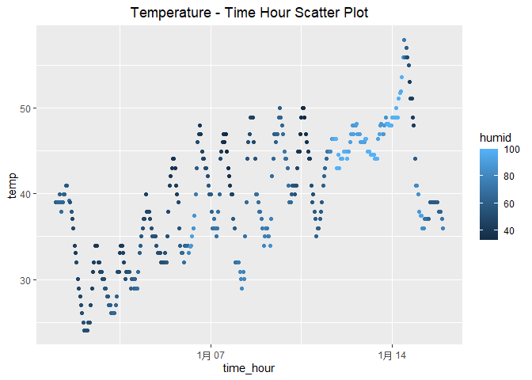

p8105_hw1_sd3731
================
Susie Dong
2023-09-23

# Problem 1

``` r
## load the dataset
library(moderndive)
library(tidyverse)
data("early_january_weather")
head(early_january_weather, 5)
```

    ## # A tibble: 5 × 15
    ##   origin  year month   day  hour  temp  dewp humid wind_dir wind_speed wind_gust
    ##   <chr>  <int> <int> <int> <int> <dbl> <dbl> <dbl>    <dbl>      <dbl>     <dbl>
    ## 1 EWR     2013     1     1     1  39.0  26.1  59.4      270      10.4         NA
    ## 2 EWR     2013     1     1     2  39.0  27.0  61.6      250       8.06        NA
    ## 3 EWR     2013     1     1     3  39.0  28.0  64.4      240      11.5         NA
    ## 4 EWR     2013     1     1     4  39.9  28.0  62.2      250      12.7         NA
    ## 5 EWR     2013     1     1     5  39.0  28.0  64.4      260      12.7         NA
    ## # ℹ 4 more variables: precip <dbl>, pressure <dbl>, visib <dbl>,
    ## #   time_hour <dttm>

## describe the dataset

This is data frame of 358 rows representing hourly measurements and 15
variables.

### variables name

``` r
colnames(early_january_weather)
```

    ##  [1] "origin"     "year"       "month"      "day"        "hour"      
    ##  [6] "temp"       "dewp"       "humid"      "wind_dir"   "wind_speed"
    ## [11] "wind_gust"  "precip"     "pressure"   "visib"      "time_hour"

### Row Size

``` r
nrow(early_january_weather)
```

    ## [1] 358

``` r
ncol(early_january_weather)
```

    ## [1] 15

### Mean Temperature

``` r
mean(pull(early_january_weather, temp))
```

    ## [1] 39.58212

## scatterplot

### create a scatterplot

``` r
ggplot(early_january_weather, aes(x = time_hour, y = temp, color = humid)) + geom_point() + 
  ggtitle("Temperature - Time Hour Scatter Plot") + theme(plot.title = element_text(hjust = 0.5))
```

<!-- -->

``` r
ggsave("hw1_scatterplot_p1.png")
```

    ## Saving 7 x 5 in image

### discribe a scatterplot

-The scatterplot demonstrates a distinct diurnal temperature variation,
characterized by daytime temperature increases and nighttime decreases,
aligning with typical daily temperature fluctuations.

-The color-coded points reveal variations in humidity levels with time
and temperature, with darker colors indicating increased humidity at
specific times, shedding light on humidity fluctuations.

-The existence of clustered points with similar colors hints at
potential groupings and patterns, potentially signifying specific times
of the day when humidity levels tend to be alike, prompting a deeper
exploration of underlying weather or climate patterns.

# Problem 2

Create a data frame comprised of:

-a random sample of size 10 from a standard Normal distribution -a
logical vector indicating whether elements of the sample are greater
than 0 -a character vector of length 10 -a factor vector of length 10,
with 3 different factor “levels” -Try to take the mean of each variable
in your dataframe. What works and what doesn’t?

## create a data frame

``` r
sample_data = rnorm(10)

df = tibble(
  vec_numeric = sample_data,
  vec_logic = sample_data > 0,
  vec_str = c("a", "b", "c", "d", "e", "f", "g", "h", "i", "j"),
  vec_factor = factor(sample(c("A", "B", "C"), 10, replace = TRUE))
)
df
```

    ## # A tibble: 10 × 4
    ##    vec_numeric vec_logic vec_str vec_factor
    ##          <dbl> <lgl>     <chr>   <fct>     
    ##  1     -0.461  FALSE     a       C         
    ##  2     -0.389  FALSE     b       C         
    ##  3      0.703  TRUE      c       B         
    ##  4     -0.0655 FALSE     d       B         
    ##  5     -0.398  FALSE     e       C         
    ##  6      2.14   TRUE      f       C         
    ##  7      0.808  TRUE      g       A         
    ##  8     -0.149  FALSE     h       B         
    ##  9     -0.281  FALSE     i       B         
    ## 10     -0.0986 FALSE     j       B

## the mean of each variable

``` r
mean_numeric = mean(pull(df, vec_numeric))
mean_lv = mean(pull(df, vec_logic))
mean_cv = mean(pull(df, vec_str))
```

    ## Warning in mean.default(pull(df, vec_str)): 参数不是数值也不是逻辑值：回覆NA

``` r
mean_fac = mean(pull(df, vec_factor))
```

    ## Warning in mean.default(pull(df, vec_factor)): 参数不是数值也不是逻辑值：回覆NA

When calculating the mean for the four variables, the numeric and
logical vectors produced numeric results, whereas the character vector
and the factor vector yielded “NA.”

``` r
mean(as.numeric(df$log_vec))
```

    ## Warning: Unknown or uninitialised column: `log_vec`.

    ## [1] NaN

``` r
mean(as.numeric(df$cha_vec))
```

    ## Warning: Unknown or uninitialised column: `cha_vec`.

    ## [1] NaN

``` r
mean(as.numeric(df$fac_vec))
```

    ## Warning: Unknown or uninitialised column: `fac_vec`.

    ## [1] NaN

## results

- The mean of numeric and logical variables can be successfully
  calculated, while the means of character and factor variables cannot
  be calculated (they return NA).

- After coercive conversion with as.numeric, the logical and factor
  variables become compatible to calculate the mean. However, for the
  character variable, it becomes compatible to calculate the mean only
  when every element of this variable consists solely of digits;
  otherwise, it returns NA.

## Explanation

-Calculating the mean is straightforward for numeric and logical
variables. Numeric variables inherently consist of numbers that can be
used in arithmetic calculations, while logical variables automatically
convert to 0 or 1 based on their boolean values.

-By using the as.numeric function, a logical variable can be forcefully
transformed into 0 or 1, and this conversion doesn’t affect the mean
calculation result.

-When the as.numeric function is applied to a factor variable, it is
transformed into natural numbers (0, 1, 2, etc.) according to the
lexicographic order of its levels, enabling it to be used in numeric
calculations.

-In the case of character variables, the as.numeric function can coerce
them into numeric values only if every element within the variable
consists solely of digits. Otherwise, the conversion process returns NA,
and any arithmetic calculation using these values also results in NA. -
the different levels in factor sequence becomes a sequence with a start
number 1.

## Conclusion

- When attempting arithmetic calculations, such as calculating the mean,
  the outcome varies significantly based on the variable type. However,
  by using the as.numeric function, it becomes possible to forcefully
  convert logical and factor variables into numeric values, making them
  suitable for arithmetic operations. In the case of character
  variables, only those containing digits can be converted to numeric
  values; otherwise, the conversion results in NA.
